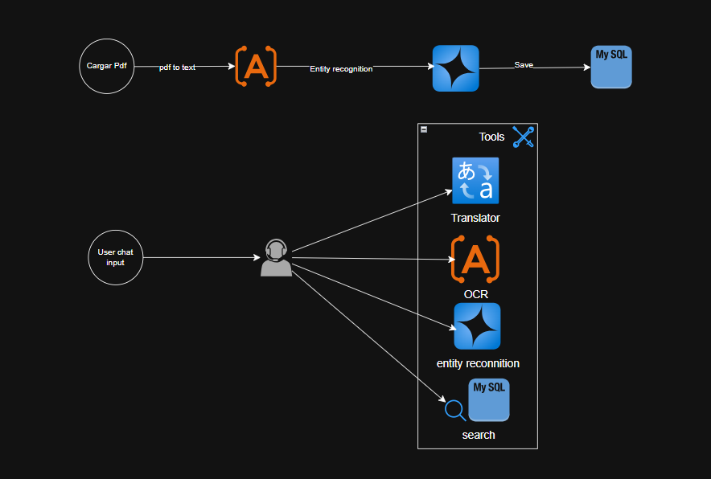

# 📄 Chatbot con Carga de Productos desde PDFs y Consulta en Base de Datos

# [APP](https://artishellerchatbot-gkb7gqe0grbpg3e7.spaincentral-01.azurewebsites.net/)

Este proyecto implementa un **chatbot** con capacidad de búsqueda y consulta sobre una base de datos de productos extraídos desde documentos PDF. Incorpora procesamiento de lenguaje natural, reconocimiento de entidades y herramientas de OCR para gestionar la información de manera eficiente.

## 🚀 Características Principales

### 🔹 Administración de Productos

- Permite la **carga de documentos PDF** con información de productos.
- Convierte los archivos **PDF a texto** utilizando OCR.
- Realiza **reconocimiento de entidades** para extraer información estructurada.
- **Guarda los datos en SQLite** para su posterior consulta.

### 🔹 Chatbot Inteligente

- **Recibe consultas de usuarios** a través de un chat.
- Utiliza herramientas de procesamiento de lenguaje natural para identificar la intención del usuario.
- Soporta:
  - 🔄 **Traducción** de consultas en distintos idiomas.
  - 🏷️ **Reconocimiento de entidades** para entender las preguntas(OpenAI).
  - 🔍 **Búsqueda en SQLite** para recuperar información relevante.
  - 📝 **OCR** como herramienta soportada para el agente.

## 🛠️ Tecnologías Utilizadas

- **Django**: Backend y frontend para la gestión del chatbot y la administración.
- **SQLite**: Base de datos para almacenar los productos.
- **Azure OpenAI**: Para el procesamiento de lenguaje natural y reconocimiento de entidades.
- **Azure AI Language**: OCR para extraer texto de los documentos PDF.
- **LangChain**: Implementación del agente conversacional.
- **Pydantic**: Validación de datos.

## 📌 Arquitectura del Proyecto

El flujo del sistema se divide en dos partes:

1️⃣ **Carga de Productos** (Administración):

- Un administrador sube un PDF con información.
- Se ejecuta el proceso de OCR para convertir el PDF en texto.
- Se aplican modelos de reconocimiento de entidades para extraer datos.
- Se almacenan los datos en **SQLite**.

2️⃣ **Chatbot Interactivo** (Usuarios):

- Los usuarios pueden interactuar con el chatbot.
- El sistema puede:
  - Traducir mensajes si es necesario.
  - Aplicar reconocimiento de entidades.
  - Consultar la base de datos y devolver respuestas relevantes.
  - Utilizar OCR como herramienta para el agente.